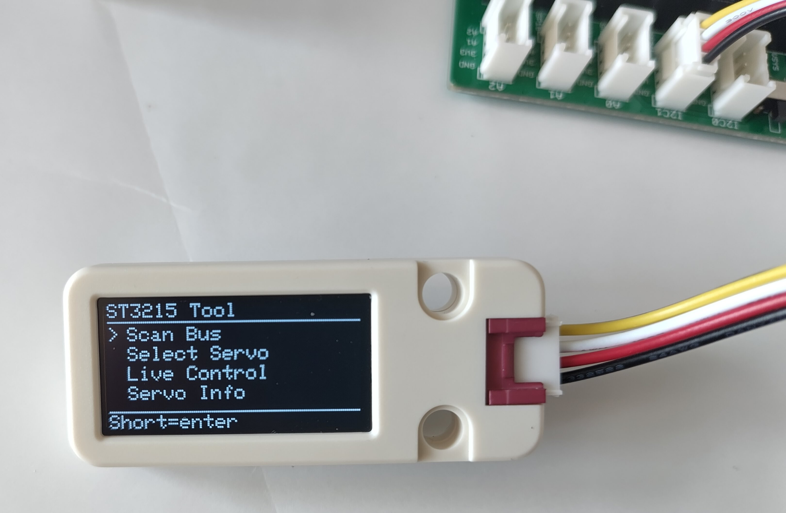
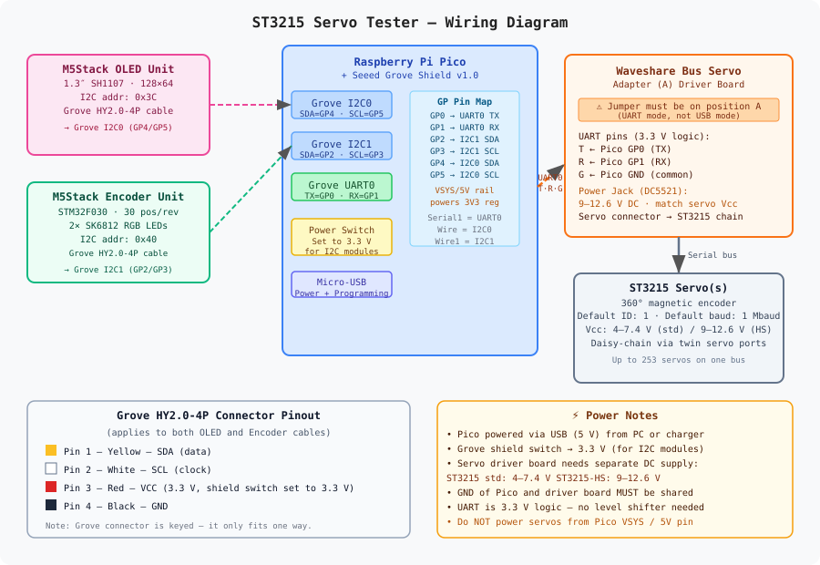

# ST3215 Servo Tester

A standalone servo configuration, control, and MIDI integration tool for **Waveshare ST3215 series** serial bus servos.  



Built on a **Raspberry Pi Pico (RP2040)** with a rotary encoder knob, OLED display, and USB MIDI — no PC required once flashed.



---

## Table of Contents

1. [Features](#features)
2. [Hardware](#hardware)
   - [Bill of Materials](#bill-of-materials)
   - [Hookup Table](#hookup-table)
   - [Wiring Notes](#wiring-notes)
3. [Screen Reference](#screen-reference)
   - [Navigation Controls](#navigation-controls)
   - [Screen Descriptions](#screen-descriptions)
4. [Software Setup](#software-setup)
   - [Prerequisites](#prerequisites)
   - [Project Setup](#project-setup-in-vscode--platformio)
   - [Building and Flashing](#building-and-flashing)
5. [Hardware Setup](#hardware-setup)
6. [Usage Guide](#usage-guide)
   - [First Boot](#first-boot)
   - [Bus Scanning](#bus-scanning)
   - [Live Control](#live-control)
   - [Configuration](#configuration)
   - [MIDI Mode](#midi-mode)
   - [Flash Diagnostics](#flash-diagnostics)
7. [MIDI Reference](#midi-reference)
   - [MIDI Setup Screen](#midi-setup-screen)
   - [MIDI Run Screen](#midi-run-screen)
   - [MIDI Monitor](#midi-monitor)
   - [MIDI Panic](#midi-panic)
   - [Smoothing Filter](#smoothing-filter)
8. [Persistent Storage](#persistent-storage)
9. [Servo Configuration Parameters](#servo-configuration-parameters)
10. [Fault Codes](#fault-codes)
11. [Known Register Names](#known-register-names)
12. [Project File Structure](#project-file-structure)
13. [External Documentation](#external-documentation)
14. [Troubleshooting](#troubleshooting)

---

## Features

### Servo Control
- **Multi-baud bus scan** — scan at any of the 8 standard ST3215 baud rates, or run *Scan All* across all 8 rates simultaneously to find servos regardless of their baud setting
- **Scan abort** — long-press during any scan to stop early and keep found servos
- **Live control** — real-time position (raw + degrees), speed, and acceleration adjustment
- **Full EPROM configuration** — Servo ID, Min/Max limits, Torque limit, Center offset, Mode (Servo/Wheel), Baud rate
- **Wheel mode safety warning** — hardware-damage warning screen before enabling continuous rotation
- **Servo info** — two-page info screen: runtime values (position, voltage, temperature) and fault status (load, current, decoded fault flags)

### MIDI
- **USB MIDI device** — appears as Class-Compliant MIDI on Windows/macOS/Linux with no driver needed
- **Per-servo CC mapping** — assign any CC number and MIDI channel to each detected servo
- **Bidirectional** — inbound CC moves servos; outgoing CC reflects actual position in real time
- **Inverted mapping** — optionally invert the CC→position scaling per servo (CC 0 → max position)
- **IIR smoothing filter** — per-servo adjustable low-pass filter (0=off, 127=very slow) for buttery-smooth CC response
- **Global CC parameters** — Speed, Acceleration, and Smoothing are each mappable as MIDI CC, applying globally to all servos simultaneously
- **MIDI monitor** — scrollable ring buffer showing last 4 messages: CC, Note On/Off, Pitch Bend, Program Change, Aftertouch
- **MIDI panic** — sends CC 121 + CC 123 on all 16 channels, clears all state

### System
- **Persistent configuration** — servo ID list, active servo, scan baud, torque, speed, acceleration, and all MIDI bindings saved to LittleFS flash; restored on boot without rescanning
- **Flash diagnostics screen** — inspect LittleFS health, file size, magic/version check, and saved servo/MIDI counts
- **Encoder LED** — glows green when encoder initialised successfully

---

## Hardware

### Bill of Materials

| # | Part | Manufacturer | Product Page |
|---|------|-------------|--------------|
| 1 | **Raspberry Pi Pico** (RP2040, headers pre-soldered recommended) | Raspberry Pi | [raspberrypi.com/products/raspberry-pi-pico](https://www.raspberrypi.com/products/raspberry-pi-pico/) |
| 2 | **Grove Shield for Pi Pico v1.0** | Seeed Studio | [seeedstudio.com/Grove-Shield-for-Pi-Pico-v1-0-p-4846.html](https://www.seeedstudio.com/Grove-Shield-for-Pi-Pico-v1-0-p-4846.html) |
| 3 | **Unit OLED 1.3″** (SH1107, 128×64) | M5Stack | [shop.m5stack.com/products/oled-unit-1-3-128-64-display](https://shop.m5stack.com/products/oled-unit-1-3-128-64-display) |
| 4 | **Unit Encoder** (STM32F030, 30 pos/rev, 2× RGB LED) | M5Stack | [shop.m5stack.com/products/encoder-unit](https://shop.m5stack.com/products/encoder-unit) |
| 5 | **Serial Bus Servo Driver Board** ("Bus Servo Adapter A") | Waveshare | [waveshare.com/bus-servo-adapter-a.htm](https://www.waveshare.com/bus-servo-adapter-a.htm) |
| 6 | **ST3215 Serial Bus Servo** (one or more) | Waveshare | [waveshare.com/st3215-servo.htm](https://www.waveshare.com/st3215-servo.htm) |
| 7 | Grove HY2.0-4P cables (included with OLED and Encoder) | — | included with modules |
| 8 | DC power supply for servos (see voltage note) | — | — |

> **ST3215 voltage variants:**
> - Standard ST3215: **4–7.4 V** supply
> - High-speed ST3215-HS: **9–12.6 V** supply
>
> Match your power supply to the servo variant. The driver board input voltage must match.

---

### Hookup Table

| Signal | Pico GPIO | Grove Shield Port | Connects to |
|--------|-----------|-------------------|-------------|
| OLED SDA | **GP4** | I2C0 (yellow) | M5Stack OLED — SDA |
| OLED SCL | **GP5** | I2C0 (white) | M5Stack OLED — SCL |
| OLED VCC | 3.3 V | I2C0 (red) | M5Stack OLED — VCC |
| OLED GND | GND | I2C0 (black) | M5Stack OLED — GND |
| Encoder SDA | **GP6** | I2C1 (yellow) | M5Stack Encoder — SDA |
| Encoder SCL | **GP7** | I2C1 (white) | M5Stack Encoder — SCL |
| Encoder VCC | 3.3 V | I2C1 (red) | M5Stack Encoder — VCC |
| Encoder GND | GND | I2C1 (black) | M5Stack Encoder — GND |
| Servo UART TX | **GP0** | UART0 T pin | Waveshare driver board — **T** |
| Servo UART RX | **GP1** | UART0 R pin | Waveshare driver board — **R** |
| Common GND | GND | Any GND | Waveshare driver board — **G** |

> ⚠ **Encoder pins changed:** The encoder now uses **GP6/GP7** (I2C1). Earlier builds used GP2/GP3. If you built against a previous version, rewire the encoder Grove cable to the I2C1 port on the shield.

**I2C addresses:**

| Device | Address | Arduino peripheral |
|--------|---------|-------------------|
| M5Stack OLED (SH1107) | `0x3C` | `Wire` (I2C0) |
| M5Stack Encoder | `0x40` | `Wire1` (I2C1) |

---

### Wiring Notes

**Grove Shield power switch**  
Set to **3.3 V** before connecting anything. Both the OLED and Encoder are 3.3 V devices.

**Waveshare driver board jumper**  
Set to **position A** (UART mode). Position B is USB mode for PC use and must not be used here.

**UART wiring is straight-through (not crossed)**  
`Pico GP0 (TX) → Board T` and `Pico GP1 (RX) → Board R`. The board handles the half-duplex bus itself.

**Shared ground is mandatory**  
The servo power supply, driver board, and Pico must share a common GND. Without this the UART signals will be unreferenced and communication will fail.

**USB is MIDI, not serial debug**  
Once flashed, the Pico's USB port enumerates as a USB MIDI device named *"ST3215 Servo Tester"*. The Arduino Serial debug port is no longer available over USB. If you need debug output, attach a UART adapter to a spare GPIO.

---

## Screen Reference

### Navigation Controls

| Action | Effect |
|--------|--------|
| **Turn knob** | Scroll menu / increment or decrement value when editing |
| **Short press** | Select item / enter edit mode / confirm edit / next edit step |
| **Long press** | Cancel edit (restores previous value) / go back to Home |

These controls are consistent across all screens.

---

### Screen Descriptions

| Screen | Access | Purpose |
|--------|--------|---------|
| **Home** | Boot / Long press from anywhere | Top-level menu with 8 items |
| **Scan Baud Select** | Home → Scan Bus | Choose one of 8 baud rates, or Scan All |
| **Scanning…** | After selecting single baud | Progress bar for ID 0–253; **Long press = stop early** |
| **Scan All Bauds** | Scan Baud Select → Scan All | Dual progress bar: outer=baud step, inner=ID; **Long press = stop** |
| **Select Servo** | Home → Select Servo | Scroll found IDs; short press to make active |
| **Live Control** | Home → Live Control | Real-time: Torque · Position · Speed · Acceleration |
| **Servo Info** | Home → Servo Info | **Page 1:** Online, Position, Voltage, Temp — **Short press** for page 2 |
| **Faults** | Servo Info → Short press | Load %, Current (mA), decoded fault flags |
| **Configure** | Home → Configure | Edit 7 EPROM parameters (scrollable, 4 rows visible) |
| **⚠ Wheel Mode** | Configure → Mode → Short press | Safety confirmation before enabling continuous rotation |
| **Confirm Save?** | Home → Save Changes | Summary of all staged config values; No / Yes |
| **Save Result** | After confirming save | OK or specific failure message |
| **MIDI Setup** | Home → MIDI Mode | Assign CC/channel/invert/smooth per servo; global Spd/Acc/Smt rows |
| **MIDI Run** | MIDI Setup → Run | Live activity: TX/RX indicators per binding; Monitor and Panic rows |
| **MIDI Monitor** | MIDI Run → MIDI Monitor | Last 4 received MIDI messages (CC, Note, PB, PC, AT) |
| **Flash Diag** | Home → Flash Diag | LittleFS health check, file size, magic/version, saved counts |

---

## Software Setup

### Prerequisites

| Tool | Notes |
|------|-------|
| **VSCode** | [code.visualstudio.com](https://code.visualstudio.com) |
| **PlatformIO IDE extension** | Install from VSCode Extensions marketplace |

PlatformIO fetches the compiler toolchain, board support, and all libraries automatically on first build.

---

### Project Setup in VSCode / PlatformIO

1. Open the project folder in VSCode (`File → Open Folder` → select the directory containing `platformio.ini`).
2. PlatformIO auto-detects the project and offers to install dependencies — accept.
3. Library dependencies in `platformio.ini` are fetched automatically:

```ini
lib_deps =
    https://github.com/workloads/scservo.git      ; SCServo/SMS_STS driver
    adafruit/Adafruit GFX Library @ ^1.11.9
    adafruit/Adafruit SH110X @ ^2.1.10
    adafruit/Adafruit TinyUSB Library @ ^3.1.0    ; USB MIDI transport
    fortyseveneffects/MIDI Library @ ^5.0.2       ; MIDI protocol layer
```

4. The board platform uses the **Earle Philhower RP2040 Arduino core**:

```ini
platform = https://github.com/maxgerhardt/platform-raspberrypi.git
board     = pico
board_build.core = earlephilhower
```

5. LittleFS is reserved via:

```ini
board_build.filesystem_size = 256k
```

6. USB is claimed by TinyUSB MIDI:

```ini
build_flags =
    -D USE_TINYUSB
    -D PICO_STDIO_UART=0
```

---

### Building and Flashing

#### Method 1 — PlatformIO toolbar

1. Click **✓ Build** (bottom status bar).
2. Hold **BOOTSEL** on the Pico, plug in USB, release.
3. Click **→ Upload** — PlatformIO uses `picotool` automatically.

#### Method 2 — Manual drag-and-drop

1. Build the project. Output is at `.pio/build/pico/firmware.uf2`.
2. Enter BOOTSEL mode (hold BOOTSEL, plug USB).
3. Copy `firmware.uf2` to the `RPI-RP2` drive.

> **First boot after flashing:** LittleFS is formatted on first use (auto-format). The device will perform a bus scan, save the result, and then boot normally from saved state on all subsequent power-ons.

---

## Hardware Setup

1. Seat the Pico on the Grove Shield (USB connector toward the shield edge).
2. **Set the Grove Shield power switch to 3.3 V.**
3. Connect the OLED (Grove cable) to the **I2C0** port on the shield.
4. Connect the Encoder (Grove cable) to the **I2C1** port on the shield.
5. Connect three wires from the UART0 Grove port (or exposed Pico header pins) to the driver board: `GP0→T`, `GP1→R`, `GND→G`. Ensure jumper is on **A**.
6. Connect servos to the driver board's servo port (daisy-chain through twin connectors).
7. Power the driver board from a suitable DC supply.
8. Power the Pico via USB. The device boots, performs an initial scan, and is immediately available as a USB MIDI device.

---

## Usage Guide

### First Boot

On the very first boot after flashing, the device has no saved state so it scans the bus at 1 Mbaud (factory default). After the scan completes, all state is saved to LittleFS. On all subsequent boots, the saved servo list is restored immediately — no scan needed.

The OLED shows `"Restored — N servo(s)"` on boot when loading from flash, or `"Scanning bus..."` on a fresh flash.

---

### Bus Scanning

**Home → Scan Bus → Scan Baud Select**

Turn the knob to select from 8 baud rates, or scroll to `>> Scan All <<`.

- **Single baud scan:** sweeps IDs 0–253 at the selected rate (~1 s at 1 Mbaud).
- **Scan All:** iterates all 8 baud rates in order. Two progress bars show baud step (1–8) and current ID sweep. Total time up to ~30 s.
- **Long press during any scan** stops early and keeps all servos found so far.

After scanning, the first found servo becomes active and its config is loaded from EPROM.

---

### Live Control

**Home → Live Control**

Four selectable rows — short press enters edit mode on the selected row, turn to change, short press to confirm, long press to cancel:

| Row | Range | Step | Notes |
|-----|-------|------|-------|
| Torque | ON / OFF | toggle | Immediately sent to servo |
| Position (T:) | 0–4095 | 8 counts | Angle shown in degrees on right; actual (A:) shown inline |
| Speed (Spd:) | 0–4095 | 10 | Re-sends position command at new speed |
| Acceleration (Acc:) | 0–254 | 1 | Re-sends position command at new acc |

A position bar at the bottom shows target (thin line) and actual (filled block) within the min–max range, with hatched areas outside the servo limits.

---

### Configuration

**Home → Configure**

7 parameters, scrollable (4 rows visible at a time). Short press to edit, turn to change, short press to confirm, long press to cancel edit.

| Row | Parameter | Range | Step |
|-----|-----------|-------|------|
| NewID | Servo ID | 0–253 | 1 |
| Min | Min position limit | 0–4095 | 8 |
| Max | Max position limit | 0–4095 | 8 |
| TrqLim | Torque limit | 0–1000 | 10 |
| Offset | Center offset | −2047..+2047 | 4 |
| Mode | Servo / Wheel | toggle | ⚠ Wheel mode warning |
| Baud | Baud rate index | 0–7 | 1 |

Changes are **staged** and only written to EPROM via **Home → Save Changes**. The header shows a `*` when unsaved changes exist.

> **Wheel mode warning:** Switching to wheel mode disables position limits. If the servo is mechanically constrained (joint with hard stops), enabling wheel mode can cause stall and burnout. The warning screen defaults to `No` and requires explicit `Yes` selection.

> **Baud rate change:** Saved last during Save Changes. The servo reboots at the new baud rate immediately. The tester will show *"Saved! Rescan needed"* — run Scan Bus at the new rate to regain communication.

---

### MIDI Mode

**Home → MIDI Mode**

#### Connecting

The Pico appears as *"ST3215 Servo Tester"* in your DAW or MIDI host. No driver needed. USB initialises before any other peripheral on boot, so the device is available within ~1.5 s of power-on.

#### MIDI Setup screen

Each row in the setup list corresponds to one binding. Turn to scroll, short press to enter edit mode. Editing cycles through 4 steps — short press advances, long press cancels the current step:

| Step | Field | Range | Notes |
|------|-------|-------|-------|
| 1 | CC number | 0–127 | `[nn]` shown while editing |
| 2 | MIDI channel | 1–16 | `[nn]` shown while editing |
| 3 | Invert | I / - | `[I]` or `[-]` while editing; per-servo only |
| 4 | Smoothing | 0–127 | `[nn]` while editing; per-servo only |

Below the per-servo rows, three global rows are always present:

| Row | Maps to | Range |
|-----|---------|-------|
| **Spd** | Global speed (all servos) | 0–127 → 0–4095 |
| **Acc** | Global acceleration (all servos) | 0–127 → 0–254 |
| **Smt** | Global smoothing (applied to all per-servo smoothing values) | 0–127 |

Scroll past these to `>Run<` and short press to start MIDI Run.

The setup screen layout (all columns always visible):

```
MIDI Setup              USB
> ID  C:nn c:nn  I  --
  Spd C:-- c:1
  Acc C:-- c:1
  Smt C:-- c:1
  >Run<
```

---

### MIDI Monitor

In MIDI Run → scroll to **MIDI Monitor** → short press.

Shows the last 4 received MIDI messages, newest at top. The monitor captures messages even before Run mode starts (while on any MIDI screen), so you can use it as a general MIDI sniffer during setup.

| Format | Meaning |
|--------|---------|
| `CC7 Ch:1 =64` | Control Change CC#7, channel 1, value 64 |
| `NOn N:60 v:100 c:1` | Note On, note 60 (middle C), velocity 100, channel 1 |
| `NOff N:60 c:1` | Note Off, note 60, channel 1 |
| `PB Ch:1 8192` | Pitch Bend, channel 1, value 8192 |
| `PC Ch:1 P:10` | Program Change, channel 1, program 10 |
| `AT Ch:1 =64` | Aftertouch (channel pressure), channel 1, value 64 |

Any key press or turn returns from the monitor to the Run screen.

---

### Flash Diagnostics

**Home → Flash Diag**

Displays 5 lines:

```
Flash Diag
FS:OK 2/256K          ← mounted, 2 KB used of 256 KB reserved
File:142B exp:142B    ← file exists, correct size
Magic:OK              ← header matches
Ver:4 OK exp:4        ← version matches current firmware
Srv:3 MIDI:2          ← 3 servos, 2 MIDI bindings saved
```

If `FS:FAIL` appears, LittleFS is not mounting — check `platformio.ini` has `board_build.filesystem_size = 256k`. If `Ver: BAD` appears, the saved data was written by an older firmware version and will be ignored (a fresh scan and re-save clears it).

---

## MIDI Reference

### Scaling

**Position → CC (outgoing):**  
`CC = map(clamp(pos, minLimit, maxLimit), minLimit, maxLimit, 0, 127)`

If `inverted = true`: `CC = 127 − CC`

**CC → Position (incoming):**  
If `inverted = true`: `CC = 127 − CC`  
`pos = map(CC, 0, 127, minLimit, maxLimit)`

**Global speed:** `speed = map(CC, 0, 127, 0, 4095)`  
**Global acc:** `acc = map(CC, 0, 127, 0, 254)`  
**Global smooth:** sets `smoothing` on all per-servo bindings to the CC value

### Smoothing Filter

An IIR (exponential moving average) low-pass filter applied to incoming CC → position:

`smoothPos = α × rawTarget + (1 − α) × smoothPos`

where `α = (128 − smoothing) / 128`

| Smoothing value | α | Behaviour |
|----------------|---|-----------|
| 0 | 1.0 | Instant — no filtering |
| 32 | 0.75 | Light smoothing |
| 64 | 0.5 | Moderate lag |
| 96 | 0.25 | Heavy smoothing |
| 127 | ≈0.008 | Very slow, second-order-like response |

The filter state is reset when the smoothing value changes, or when the servo binding is rebuilt.

### Rate limiting

To prevent servo bus saturation with multiple servos and high MIDI rates:

- **Outgoing (TX):** one servo polled per 25 ms window, round-robin across all bound servos. With N servos, each servo sends at 1000/(25×N) Hz.
- **Incoming (RX):** intermediate CC values received between 25 ms flush windows are discarded — only the most recent value is applied. This decouples USB MIDI receive rate from servo bus write rate.

---

## Persistent Storage

Configuration is saved to **LittleFS** flash (256 KB reserved at the top of the Pico's 2 MB flash). Written as a binary blob to `/config.bin` with a temp-file rename for atomicity.

**What is saved automatically:**

| Data | Trigger |
|------|---------|
| Servo ID list + active index | After every scan |
| Scan baud index | After every scan |
| Torque on/off | When toggled in Live Control |
| Speed | When changed in Live Control or via MIDI |
| Acceleration | When changed in Live Control or via MIDI |
| All MIDI bindings (CC, channel, invert, smooth) | When leaving MIDI Setup or starting Run |
| Global MIDI CC assignments (Spd/Acc/Smt) | Same as above |

**What is NOT saved here** (lives in servo EPROM):  
Min/Max limits, Torque limit, Center offset, Mode, Baud rate index, Servo ID — these are written by **Save Changes**.

**Version management:**  
`PERSIST_VERSION = 6`. If firmware is updated and the version changes, the saved file is rejected and a fresh scan runs automatically. The version is visible on the Flash Diag screen.

---

## Servo Configuration Parameters

| Parameter | Register | Range | Notes |
|-----------|----------|-------|-------|
| Servo ID | `SMS_STS_ID` | 0–253 | Must be unique on bus |
| Min Limit | `SMS_STS_MIN_ANGLE_LIMIT_L` | 0–4095 | Must be < Max |
| Max Limit | `SMS_STS_MAX_ANGLE_LIMIT_L` | 0–4095 | Must be > Min |
| Torque Limit | `SMS_STS_TORQUE_LIMIT_L` | 0–1000 | 1000 = full torque |
| Center Offset | `SMS_STS_OFS_L` | −2047..+2047 | Signed, wire format is two's complement |
| Mode | `SMS_STS_MODE` | 0 = Servo, 1 = Wheel | See wheel mode warning |
| Baud Rate | `SMS_STS_BAUD_RATE` | 0–7 | See baud table |

### Baud Rate Index Table

| Index | Baud Rate | Notes |
|-------|-----------|-------|
| **0** | **1,000,000** | Factory default |
| 1 | 500,000 | |
| 2 | 250,000 | |
| 3 | 128,000 | |
| 4 | 115,200 | |
| 5 | 76,800 | |
| 6 | 57,600 | |
| 7 | 38,400 | |

### Position to Degrees

`degrees = position × (360.0 / 4095.0)`

---

## Fault Codes

Read from register 65 (0x41 — Present Status). Each bit represents an independent fault condition. Multiple faults can be active simultaneously.

| Bit | Fault | Description |
|-----|-------|-------------|
| 0 | **Voltage** | Supply voltage out of operating range (over or under) |
| 1 | **Sensor** | Magnetic encoder failure or communication error |
| 2 | **Overtemp** | Motor or electronics temperature exceeded limit |
| 3 | **Overcurrent** | Motor current exceeded instantaneous limit |
| 4 | **Angle** | Commanded position outside the configured Min/Max limits |
| 5 | **Overload** | Sustained torque overload — motor stalling under load |

The Servo Info → Faults page also shows **Load %** (register 60–61, signed) and **Current mA** (register 69–70, ~6.5 mA/LSB).

---

## Known Register Names

If your SCServo library version uses different symbol names, substitute the raw addresses:

| Symbol | Address | Description |
|--------|---------|-------------|
| `SMS_STS_ID` | `0x05` | Servo ID |
| `SMS_STS_BAUD_RATE` | `0x06` | Baud rate index |
| `SMS_STS_MIN_ANGLE_LIMIT_L` | `0x09` | Min angle (low byte) |
| `SMS_STS_MAX_ANGLE_LIMIT_L` | `0x0B` | Max angle (low byte) |
| `SMS_STS_MODE` | `0x0D` | Operating mode |
| `SMS_STS_OFS_L` | `0x1F` | Center offset (low byte) |
| `SMS_STS_TORQUE_LIMIT_L` | `0x23` | Torque limit (low byte) |
| `SMS_STS_PRESENT_LOAD_L` | `0x3C` | Present load (low byte) |
| `SMS_STS_PRESENT_CURRENT_L` | `0x45` | Present current (low byte) |

---

## Project File Structure

```
servo-tester/
├── platformio.ini
└── src/
    ├── main.cpp                    Hardware init · USB MIDI first · boot sequence
    ├── config.h                    All pin and address constants
    ├── app_state.h                 AppState struct (runtime state)
    ├── model/
    │   └── servo_model.h           Enums · baud table · ServoConfigBuffer
    │                               MidiServoBinding · MidiState · MidiLogEntry
    ├── app/
    │   ├── app.h                   App class declaration
    │   └── app.cpp                 State machine · input handlers · scan logic
    │                               MIDI tick · smoothing filter · persistence wiring
    └── drivers/
        ├── oled_ui.h / .cpp        All OLED screen rendering (15 screens)
        ├── servo_bus.h / .cpp      SCServo UART wrapper · EPROM read/write
        │                           Fault · load · current reads
        ├── midi_engine.h / .cpp    TinyUSB MIDI · CC/Note/PB/PC/AT callbacks
        ├── persist.h / .cpp        LittleFS save/load · diagnostics
        └── encoder_unit.h / .cpp   M5Stack Encoder I2C driver
```

---

## External Documentation

| Resource | URL |
|----------|-----|
| Seeed Grove Shield for Pi Pico — Wiki | https://wiki.seeedstudio.com/Grove_Shield_for_Pi_Pico_V1.0/ |
| M5Stack Unit OLED — Docs | https://docs.m5stack.com/en/unit/oled |
| M5Stack Unit Encoder — Docs | https://docs.m5stack.com/en/unit/encoder |
| Waveshare Bus Servo Adapter (A) — Wiki | https://www.waveshare.com/wiki/Bus_Servo_Adapter_(A) |
| Waveshare ST3215 Servo — Wiki | https://www.waveshare.com/wiki/ST3215_Servo |
| SCServo Arduino library | https://github.com/workloads/scservo |
| Adafruit SH110X library | https://github.com/adafruit/Adafruit_SH110X |
| Adafruit TinyUSB library | https://github.com/adafruit/Adafruit_TinyUSB_Arduino |
| fortyseveneffects MIDI Library | https://github.com/FortySevenEffects/arduino_midi_library |
| Earle Philhower RP2040 Arduino core | https://github.com/earlephilhower/arduino-pico |
| Raspberry Pi Pico datasheet | https://datasheets.raspberrypi.com/pico/pico-datasheet.pdf |

---

## Troubleshooting

| Symptom | Likely cause | Fix |
|---------|-------------|-----|
| OLED blank | Wrong I2C port or address | OLED on I2C0 (GP4/GP5); check 0x3C; shield power switch → 3.3 V |
| Encoder unresponsive | Wrong I2C port | Encoder on I2C1 (GP6/GP7); address 0x40 |
| "No servo" on boot | No saved state + servo not powered at 1 Mbaud | Power servos before Pico; or run Scan All |
| Boot always scans | Flash not saving | Check Flash Diag; verify `board_build.filesystem_size = 256k` in platformio.ini |
| Flash Diag shows `Ver:BAD` | Firmware updated, old file on flash | Expected — device rescans once and writes new file |
| No USB MIDI in DAW | USB init order wrong | Ensure you are using the latest `main.cpp` (MIDI init is first in `setup()`) |
| MIDI works then disappears | USB enumeration race | The 1.5 s USB wait in `setup()` should prevent this; try a powered USB hub |
| Servo moves jerky | Speed too high or acc too low | Reduce Speed; increase Acc in Live Control |
| Save fails "ID write failed" | Comms lost during EPROM write | Power-cycle servo; retry |
| After baud change, servo gone | Bus still at old rate | Scan Bus → Scan All to find servo at new rate |
| Wheel mode won't engage | Safety screen default is No | Must explicitly turn to Yes on the ⚠ screen |
| `SMS_STS_MODE` compile error | Library symbol name differs | Replace with `0x0D` in `servo_bus.cpp` |
| `SMS_STS_OFS_L` compile error | Library symbol name differs | Replace with `0x1F` in `servo_bus.cpp` |
| MIDI monitor always empty | Monitor unreachable (old firmware) | Ensure latest `oled_ui.cpp` — `totalBindings = count + 3` |
| PlatformIO won't find Pico port | Driver not installed | Install Zadig (Windows) or check udev rules (Linux) |